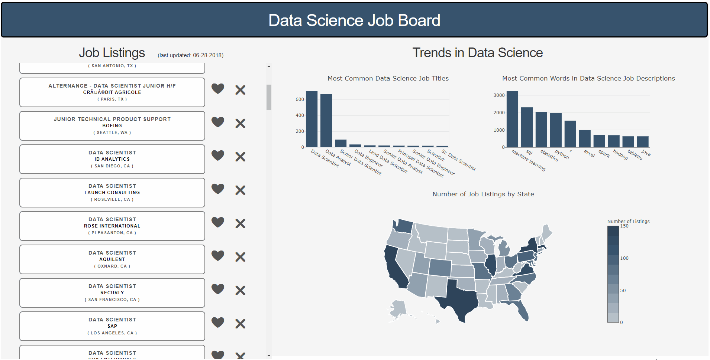

# Data Science Job Board

## What is Data Science Job Board?
This is a web app that presents a recommended list of Glassdoor job search results along with summary visualizations about the jobs. The app continuously learns to show more relevant jobs listings as the user likes/dislikes job postings they are shown.

## Python tools used for this project (and their purpose):
- Selenium (web scraping)
- BeautifulSoup (parsing web scrape)
- Pandas (organization/filtering of data)
- Dash (web app and visualizations... it is Plotly + Flask)
- Sklearn (recommendation modeling)

## Basic structure of the project:

## Demo to showcase the web application:

